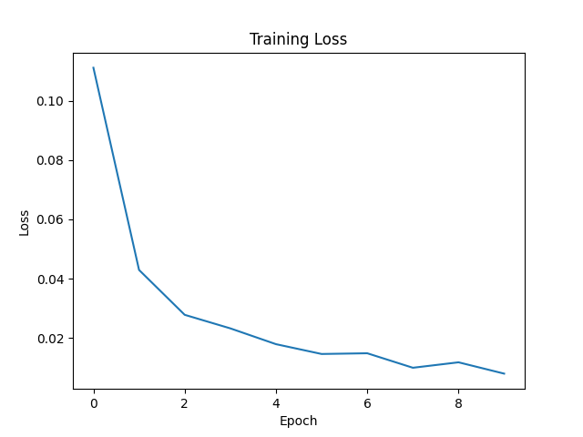
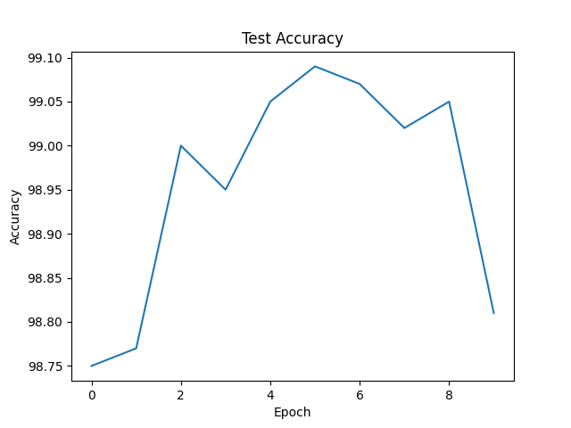
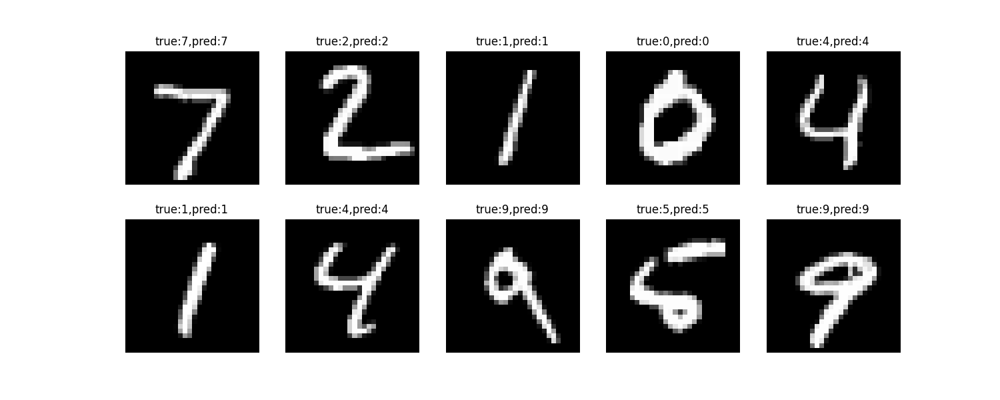

# 基于 PyTorch 的 MNIST 手写数字分类

一个基于 PyTorch 实现的模块化手写数字分类项目。

本项目使用 CNN 和 MLP 模型完成 MNIST 手写数字分类任务，并实现：

- 模块化的数据集、模型和训练流程
- 基于 YAML 的实验参数管理
- 训练与评估流程分离
- 最优模型权重保存
- Loss 与 Accuracy 可视化
- 测试样例预测结果展示


本项目旨在构建一个可复用的深度学习项目模板（主要针对本人后续学习使用），并作为未来计算机视觉任务的基础框架。


> 💬 作者碎碎念：
>
> 本项目基本纯手搓，花费约 12 小时完成。
>
> 这是本人于 2026 年寒假完成的第一个深度学习入门实践 —— MNIST 手写数字识别项目。
>
> 半年后重新回顾该项目，并对原本单文件代码进行了工程化重构，希望通过这个过程进一步理解深度学习项目从实验代码到完整工程的转换。
>
> 代码中保留了大量个人学习过程中的注释，这些内容代表本人对于该项目的理解与思考。
>
> 如果项目中存在错误，欢迎指出与交流。
>
> 后续也会继续整理并发布自己的其他学习项目。


---

# ✨ 项目特点

- ✅ 基于 PyTorch 实现
- ✅ 支持 CNN 与 MLP 模型
- ✅ 支持 GPU 加速
- ✅ 可通过配置文件调整实验参数
- ✅ 自动保存最佳模型
- ✅ 训练过程可视化
- ✅ 清晰的项目结构


---

# 🚀 快速开始


## 1. 克隆项目


```bash
git clone https://github.com/LarryChen18/MNIST-with-CNN-and-MLP.git

cd MNIST-with-CNN-and-MLP
```


---

## 2. 安装依赖


创建环境：

```bash
conda create -n mnist python=3.10

conda activate mnist
```


安装依赖：

```bash
pip install -r requirements.txt
```


主要依赖：

```
torch
torchvision
pyyaml
matplotlib
```


---

# 3. 配置训练参数


所有实验参数均通过：

```
config.yaml
```

进行管理。


示例：

```yaml
dataset:
  batch_size: 64

model:
  name: CNN

train:
  epochs: 10
  lr: 0.001
```


可修改参数：

| 参数 | 说明 |
|-|-|
| batch_size | 每次训练输入的数据数量 |
| epochs | 训练轮数 |
| lr | 学习率 |
| model.name | 使用的模型类型（CNN 或 MLP） |


---

# 4. 训练模型


运行：

```bash
python src/train.py
```


训练过程中输出：

```
Epoch [1/10], Loss:0.1080, Accuracy:97.65%, Best-Accuracy:97.65%
```


---

# 5. 查看训练结果


训练完成后：

```
MNIST-with-CNN-and-MLP

├── checkpoints
│   └── best_model.pth
│
└── results
    ├── loss.png
    ├── accuracy.png
    └── demo.png
```


## 模型权重


`best_model.pth`

保存训练过程中测试集准确率最高的模型。


---

## 训练曲线


Loss 曲线：

```
results/loss.png
```


Accuracy 曲线：

```
results/accuracy.png
```


---

# 📊 实验结果


## 训练配置


| 参数 | 设置 |
|-|-|
| Model | CNN |
| Epochs | 10 |
| Batch Size | 64 |
| Learning Rate | 0.001 |


---

## 最终训练结果


```
Epoch [10/10], Loss:0.0089, Accuracy:98.91%

Best-Accuracy:99.27%
```


说明：

- `Accuracy:98.91%` 为第 10 轮训练结束时模型在测试集上的准确率
- `Best-Accuracy:99.27%` 为整个训练过程中保存的最高测试准确率


---

## Loss变化





---

## Accuracy变化





---

## 模型预测示例





---

# 🧩 代码结构说明


## dataset.py


负责：

- MNIST 数据加载
- 数据预处理
- DataLoader 构建


数据流程：

```
MNIST Dataset

↓

Transform

↓

DataLoader

↓

Batch 数据
```


---

# models/


保存模型结构。


## CNN.py


实现卷积神经网络。


主要组件：

- Conv2d
- ReLU
- MaxPooling
- Fully Connected Layer


---

## MLP.py


实现基础全连接神经网络。


用于：

比较 CNN 与传统全连接网络在图像任务中的差异。


---

# train.py


负责：

- 加载配置文件
- 创建模型
- 定义 Loss 函数
- 初始化优化器
- 执行训练流程
- 保存最佳模型
- 预测可视化(demo)


---

# test.py


负责：

- 模型评估
- Accuracy 计算


评估流程：

```
model.eval()

↓

torch.no_grad()

↓

forward传播

↓

预测结果

↓

accuracy计算
```


---

# utils.py


包含通用工具函数：

- 模型保存
- Loss 曲线绘制
- Accuracy 曲线绘制
- 测试样例预测可视化
- 自动创建文件夹


---

# 🧠 模型设计说明


## 为什么选择 CNN？


图像数据具有明显的空间结构。


对于 MNIST：

- 数字由局部线条和边缘组成
- 有效特征通常只存在于图片局部区域
- 相同特征可能出现在不同位置


CNN 能够自动学习：


- 边缘特征
- 形状特征
- 数字特征


相比全连接网络：

CNN通过：

- 局部感受野（卷积核所在的局部区域内特征的提取）
- 权重共享(一张特征图共用一个卷积核)

减少参数数量，同时提升图像特征提取能力。


---

# 🔄 模型训练流程


完整训练过程：

```
输入图片

↓

CNN特征提取（卷积层）

↓

分类层（全连接层）

↓

输出 logits

↓

CrossEntropyLoss计算loss

↓

反向传播

↓

优化器更新参数
```


---

# 📌 关键实现说明


## 1. 模型初始化与训练过程


神经网络在开始训练时，模型参数通常会进行随机初始化。


因此，在训练初期：

- 卷积核参数是随机的
- 全连接层权重是随机的
- 输出结果无法与真实标签对应


例如：

输入一张数字图片：

```
真实标签：7
```

模型可能输出：

```
预测概率：

0:0.1
1:0.2
2:0.3
...
7:0.05
```

此时模型并不知道哪些特征对应哪些数字。


训练的过程实际上就是：

> 不断调整模型参数，使输入图片经过网络后得到的输出逐渐接近真实标签。


---

# 2. CNN为什么适合图像任务？（前文已提及）


图片具有明显的空间结构。


对于MNIST：

- 数字由局部线条和边缘组成
- 有效特征通常只存在于图片局部区域
- 相同特征可能出现在不同位置


如果使用普通全连接网络：

每个像素都需要连接下一层神经元。


对于：

```
28×28
```

的图片：

输入维度：

```
784
```

会产生大量参数。


而CNN通过：

### 局部感受野

卷积核只关注图片局部区域。


### 权重共享

同一个卷积核可以扫描整张图片。


减少大量参数，同时能够学习：

```
边缘特征

↓

形状特征

↓

数字特征
```


因此CNN更加适合处理图像任务。


---

# 3. Conv2d参数理解


PyTorch中的卷积层：

```python
Conv2d(
    input_channels,
    output_channels,
    kernel_size,
    stride,
    padding
)
```


例如：

```python
Conv2d(1,32,3)
```


表示：

输入：

```
1个通道（灰度通道）
```

输出：

```
32个特征图
```


其中：


32代表使用32个不同的卷积核。


每个卷积核负责提取不同类型的特征，例如：

- 横向边缘
- 纵向边缘
- 曲线结构
- 局部纹理


最终得到更加丰富的特征表示。


---

# 4. 为什么需要池化层？


池化层主要作用：

- 降低特征图尺寸
- 减少计算量
- 保留主要特征


例如：

```
28×28

↓

14×14
```


图片中并不是所有区域都包含有效信息。


通过MaxPooling：

模型会保留局部区域中响应最大的特征值。


这样可以：

- 突出关键特征
- 减少无效信息
- 提升模型泛化能力


---

# 5. 模型输出与预测类别


网络最后输出：

```
(batch_size,10)
```


这10个值代表：

数字0-9对应的logits（激活值）。


注意：

这些值**不是概率**


而是模型经过计算得到的激活值。


例如：

```
[
0.2,
1.5,
6.8,
0.3,
...
]
```


最大值： 6.8

对应索引： 2


因此预测结果： 数字2


代码：

```python
_, predicted = torch.max(outputs,1)
```
_为占字符，说明只取最大值的索引，而1代表在某一行（某一张图片）中取最大值（按列索引取）

其中最大值所在的索引：

就是模型预测的数字类别。


---

# 6. Loss、反向传播与参数更新


本项目使用：

```python
CrossEntropyLoss()
```


计算模型预测结果与真实标签之间的差距。


训练过程：

```
Forward传播

↓

计算Loss

↓

BackPropagation

↓

计算梯度

↓

Optimizer更新参数
```


其中：

### Loss

告诉模型：

> 当前预测结果距离正确答案还有多远。


### 反向传播

通过链式法则计算：

> 每个参数应该如何调整。


### 梯度下降

根据梯度方向：

> 更新参数，使下一次预测更加准确。


最终目标：

降低Loss，提高模型准确率。


---

# 7. 为什么保存Best Accuracy模型？


训练过程中：

训练集Loss不断下降，并不一定代表模型越来越好。


可能出现：

```
训练集效果很好

↓

测试集效果下降
```

即：

**过拟合**。


因此本项目不会简单保存最后一次训练结果，而是：

记录测试集Accuracy最高的模型。


这样保存的模型：

通常具有更好的泛化能力。


---

# 8. 训练模式与测试模式


训练阶段：

```python
model.train()
```


作用：

- 开启训练模式
- Dropout随机失活
- BatchNorm更新统计量


同时：

需要计算梯度并更新参数。


---

测试阶段：

```python
model.eval()
```


作用：

- 固定模型状态
- 不更新参数


结合：

```python
with torch.no_grad():
```


关闭梯度计算。


优势：

- 降低显存占用
- 提升推理速度


---

# 9. Accuracy计算


模型预测：

```python
predicted == labels
```


得到：

```
True / False
```


例如：

```
True
False
True
True
```


转换为：

```
1
0
1
1
```


通过：

```python
sum()
```


统计预测正确数量。


最终：

```
accuracy = correct / total
```


---

# 10. 从单文件代码到工程化项目（本项目的重心）


最初的MNIST代码通常：

```
一个py文件

↓

数据加载

↓

模型定义

↓

训练

↓

测试

↓

绘图
```


虽然可以运行，但是：

- 可读性较差
- 不方便修改
- 不利于复用


因此本项目进行了模块化重构：


```
dataset.py

负责数据


model.py

负责模型


train.py

负责训练流程


test.py

负责评估


utils.py

负责通用工具


config.yaml

负责实验参数
```
---

# 🏗️ 工程设计说明


## 为什么拆分 train 和 test？


训练：

```
forward

↓

loss计算

↓

backward

↓

参数更新
```


测试：

```
forward

↓

预测

↓

计算accuracy
```


分离可以提高代码可读性和复用性。


---

# 为什么使用 config.yaml？


相比直接在代码中写：

```python
lr = 0.001
epochs = 10
```


配置文件具有：

- 更方便的参数调整
- 更清晰的实验记录
- 更好的代码维护性


---

# 为什么将绘图和模型保存放入 utils？


train.py：

> 负责控制训练流程


utils.py：

> 提供通用工具


遵循：

> 单一职责原则（Single Responsibility Principle）


---

# 🔮 后续改进方向


## 模型方向

- Batch Normalization
- Dropout
- ResNet


---

## 训练方向

- TensorBoard实验记录
- 学习率调度器
- Validation Set


---

# 📚 参考资料


- PyTorch官方文档
- 《Deep Learning with PyTorch》


---

# Author


Larry Chen

AI学习路线探索者
